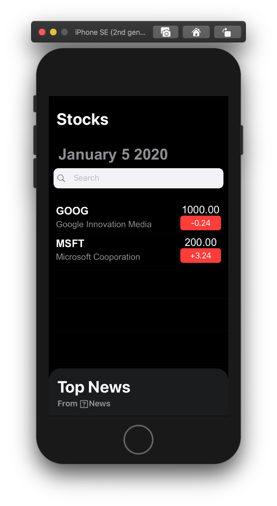
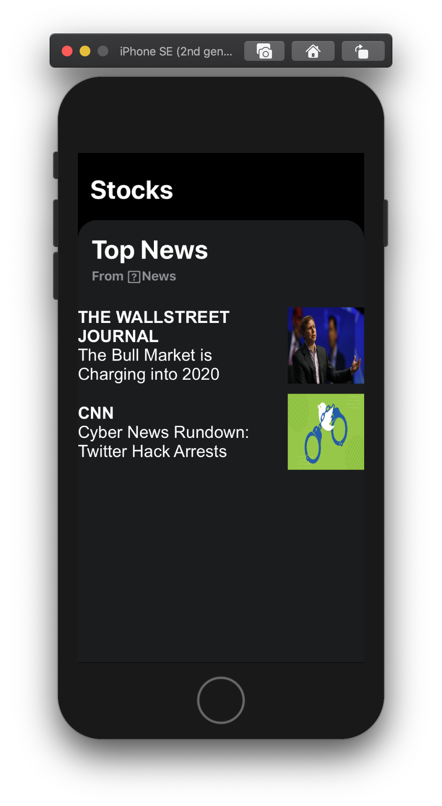

<h4 align="center">
  SwiftUI application that shows stocks and news data | This is my result after completing a section of the course Declarative Interfaces for any Apple Device, available on Udemy
</h4>

 

  <a href="#computer-technologies">Technologies</a>&nbsp;&nbsp;&nbsp;|&nbsp;&nbsp;&nbsp;
  <!-- <a href="#installing-the-application">How to run</a>&nbsp;&nbsp;&nbsp;|&nbsp;&nbsp;&nbsp; -->
  <a href="#page_facing_up-license">License</a>&nbsp;&nbsp;&nbsp;|&nbsp;&nbsp;&nbsp;
  <a href="#mailbox_with_mail-get-in-touch">Get in touch</a>

  

### :computer: Technologies

This project was developed with the following technologies:

-  

-  
<!-- -  [json-server](https://github.com/typicode/json-server) -->

### About

A small iOS application that fetchs stocks and news data, made with SwiftUI.

### Preview

<h1 align="center">
    
</h1>

<h1 align="center">
    
</h1>

### Acknowledgment

This project is my result after completing a section of the course [SwiftUI - Declarative Interfaces for any Apple Device](https://www.udemy.com/course/swiftui-declarative-interfaces-for-any-apple-device/).

### :page_facing_up: License

This project is under the MIT license. 

### :mailbox_with_mail: Get in touch!

[LinkedIn](https://www.linkedin.com/in/diegojurfest/)

### Thats it ! :wave:

---

by Diego Jurfest :tada:
